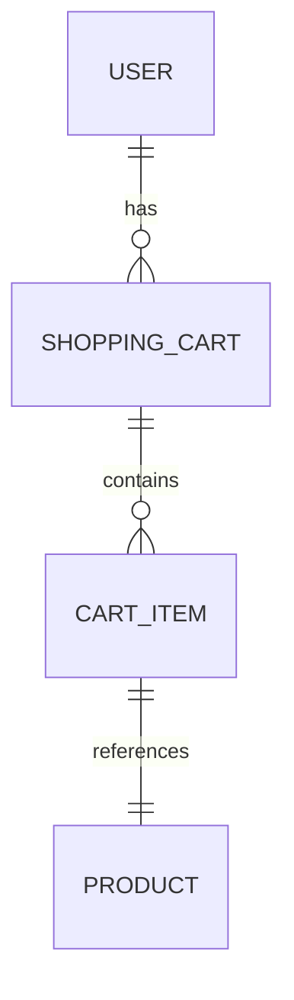

# Inventory System Design Document

## Overview
This document outlines the design for an inventory system that includes users, shopping carts, cart items, and product inventory for an online store.

## Entities and Relationships

### Entities
- **User**: Represents a store customer with personal information
- **ShoppingCart**: Represents a user's shopping cart containing items
- **CartItem**: Represents an item in a cart with quantity
- **Product**: Represents a product in the inventory with stock and pricing

### Relationships
- User has one ShoppingCart (1:1)
- ShoppingCart contains multiple CartItems (1:many)
- CartItem references one Product (many:1)

## UML Class Diagram

```mermaid
classDiagram
    class BaseModel {
        +id: int
    }
    
    class User {
        +name: str
        +email: str
        +cart: ShoppingCart
    }
    
    class ShoppingCart {
        +user_id: int
        +items: list[CartItem]
    }
    
    class CartItem {
        +cart_id: int
        +product_id: int
        +quantity: int
    }
    
    class Product {
        +name: str
        +price: float
        +stock: int
    }
    
    BaseModel <|-- User
    BaseModel <|-- ShoppingCart
    BaseModel <|-- CartItem
    BaseModel <|-- Product
    
    User ||--o{ ShoppingCart : has
    ShoppingCart ||--o{ CartItem : contains
    CartItem ||--|| Product : references
```

## ERD Diagram




