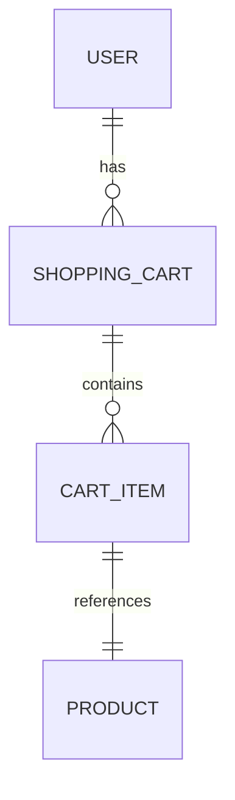

# Inventory System Requirements and Implementation

## Requirements

### Functional Requirements
- **User Management**:
  - Users can register with name and email
  - Users can log in and manage their profiles
  - Each user has one shopping cart

- **Product Management**:
  - Products have name, price, and stock quantity
  - Admins can add, update, or remove products
  - Users can browse and search products

- **Shopping Cart**:
  - Users can add products to their cart with quantities
  - Users can view, update, or remove items from cart
  - Cart persists across sessions

- **Checkout and Inventory**:
  - Users can checkout, which creates an order and updates product stock
  - Prevent ordering more than available stock

### Non-Functional Requirements
- **Performance**: Handle up to 1000 concurrent users
- **Security**: Secure user data, use HTTPS, input validation
- **Scalability**: Modular design for easy extension
- **Usability**: Simple, intuitive interface

## Implementation Suggestions

### Architecture
- **Microservices**: Separate services for user management, product catalog, cart, and orders
- **API-Driven**: RESTful APIs for frontend-backend communication

### Technologies
- **Backend**: Python with FastAPI for high-performance APIs
- **Database**: PostgreSQL with SQLAlchemy ORM for data persistence
- **Frontend**: React.js for dynamic user interface
- **Authentication**: JWT tokens for secure sessions
- **Deployment**: Docker containers with Kubernetes for scalability

### Database Schema
Based on the ERD:

Tables:
- user (id, name, email, password_hash)
- shopping_cart (id, user_id)
- cart_item (id, cart_id, product_id, quantity)
- product (id, name, price, stock)

### API Endpoints
- `/users` - User CRUD
- `/products` - Product CRUD (admin only)
- `/cart` - Cart operations
- `/checkout` - Process order

### Security Considerations
- Password hashing with bcrypt
- Rate limiting on APIs
- CORS configuration for frontend

### Testing
- Unit tests for models and business logic
- Integration tests for APIs
- End-to-end tests for user flows
